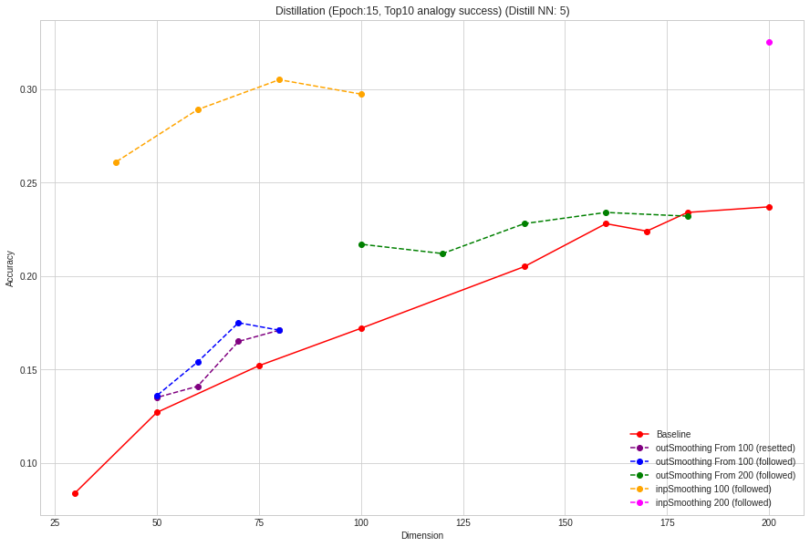

# fastText-iterative
fastText-iterative is a library for creating smaller (but efficient) fastText models. Forked from original [fastText](https://fasttext.cc/).

## What is new?

It has everything that the official fastText 0.9.1 release has.

### Analogy Tests

You can start a multithreaded analogy test by running:

```
$ ./fasttext test-analogies <model> <folder> <k>

  <model>      model filename
  <folder>     directory of analogies text files
  <k>          (optional; 10 by default) consider score if analogy in top k labels
```

It will start a thread for each text file in the directory. 
```
$ ./fasttext test-analogies ./models/enwik_e15_d200.bin ../analogy_test

Loading model ./models/enwik_e15_d200.bin
[              gram2-opposite.txt ] has started.
[           gram3-comparative.txt ] has started.
[    gram1-adjective-to-averb.txt ] has started.
~
./models/enwik_e15_d200.bin
[              gram2-opposite.txt ] Correct: 567	 Total: 812 	 Soft10 Acc: 0.6983
[           gram3-comparative.txt ] Correct: 308	 Total: 1332 	 Soft10 Acc: 0.2312
[    gram1-adjective-to-averb.txt ] Correct: 461	 Total: 992 	 Soft10 Acc: 0.4647
Elapsed Time: 75.1 second.
Mean accuracy: 0.4647% 
```
Recommended analogy set: [Google analogy test set](https://aclweb.org/aclwiki/Google_analogy_test_set_(State_of_the_art))

### Saving nearest neighbors for each word in a model

In our distillation method, we need to get NN info from big models. Therefore, precalculating and using those when it's necessery makes our job easier.

To save all NN's of a model:
```
$ fasttext save-nn <model> <outpath>

  <model>      model filename
  <outpath>    where NN file will save
```

### Distillation



Note that this chart will be updated periodically. Last update is October 31 2020.

### Distillation method 1: Output Smoothing

Our Output Smoothing method performs as follows.

 For each (input, target) tuple from training data, perform an extra training with
 - (input, big_NN(target, 1)),
 - (input, big_NN(target, 2)),
 - (input, big_NN(target, 3)),
 - (input, big_NN(target, 4)),
 - (input, big_NN(target, 5))
 examples.
 
 Where big_NN(target, n) gives the nth nearest neighbor of target in the big model.
 
 #### Example
 
 Let's say you have a big model with 100 dimension. First, create a precomputed nn file using the command mentioned above (This is optional but saves time in multiple uses). In order to create a 60 dimension model with using the distillation method, run:
 
 ```
 $ ./fasttext skipgram -input ./your_data -output ./small_model_dim60 -dim 60 -distillFrom ./models/my_big_model_dim100.bin -precomputedNN ./nnfiles/my_big_model_dim100.nn -outputSmoothing
 ```
 This will train a new model that is distilled from your big model.
 
 ### Distillation method 2: Input Smoothing

Our Input Smoothing method performs as follows.

 For each (input, target) tuple from training data, perform an extra training with
 - (big_NN(input, 1), target),
 - (big_NN(input, 2), target),
 - (big_NN(input, 3), target),
 - (big_NN(input, 4), target),
 - (big_NN(input, 5), target)
 examples.
 
 Where big_NN(input, n) gives the nth nearest neighbor of input in the big model.
 
 #### Example
 ```
 $ ./fasttext skipgram -input ./your_data -output ./small_model_dim60 -dim 60 -distillFrom ./models/my_big_model_dim100.bin -precomputedNN ./nnfiles/my_big_model_dim100.nn -inputSmoothing
```

## License

fastText is MIT-licensed.
